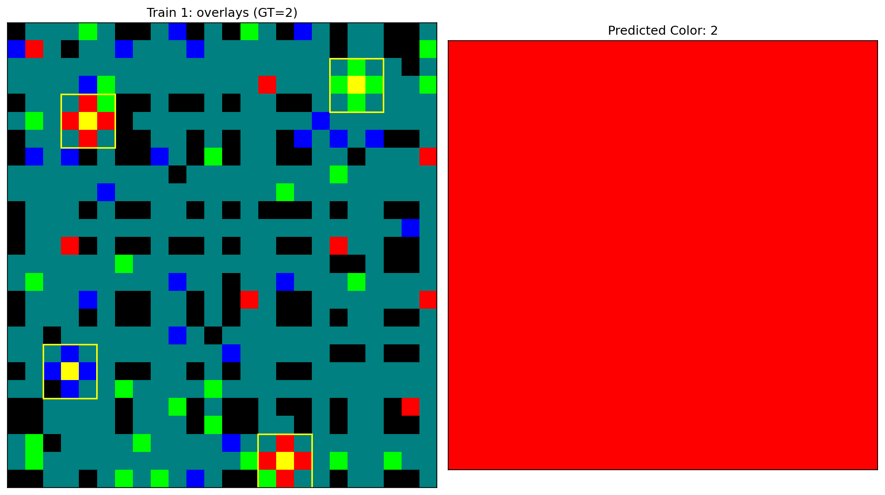
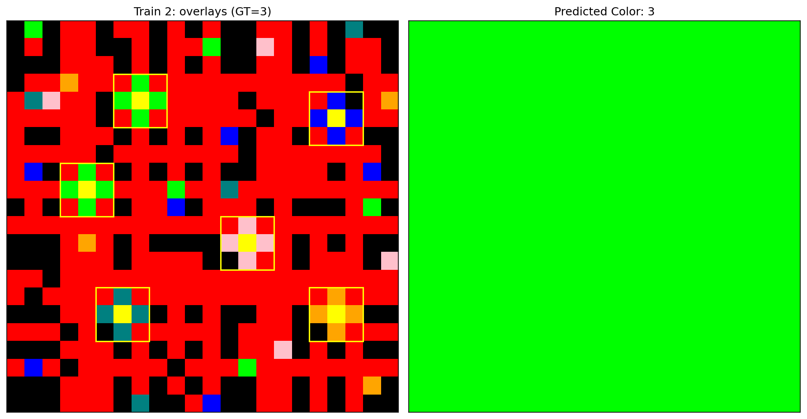
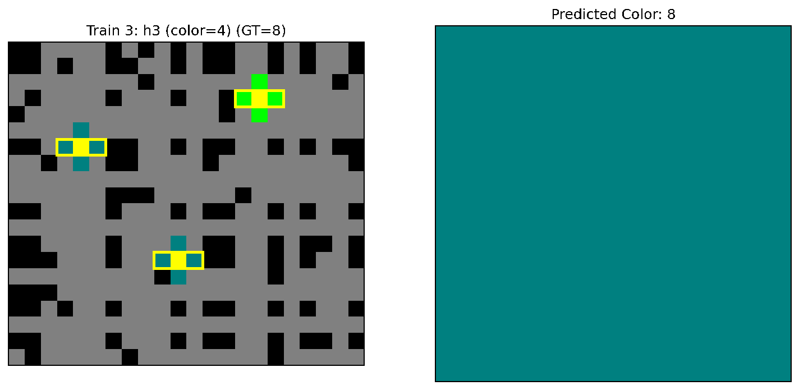
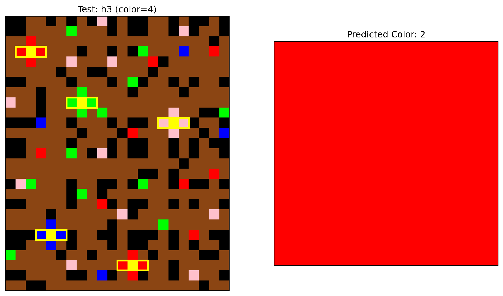

# ARC Task 642d658d (Pattern-only)

## Task at a glance

| Train 0 Input | Train 0 Output |
|---|---|
|  |  |

| Train 1 Input | Train 1 Output |
|---|---|
|  |  |

| Train 2 Input | Train 2 Output |
|---|---|
|  |  |

| Test 0 Input |
|---|
|  |

## Pattern overlays in action
- Left: grid with overlays for each pattern kind.
  - `overlay_train_i.png`: h3 (horizontal `(x,c,x)` centers, for chosen color `c`)
  - `overlay_train_i_v.png`: v3 (vertical `(x,c,x)` centers, for chosen color `c`)
  - `overlay_train_i_x.png`: schema_nxn (one overlay per pixel of color `c`; shown as a cross)
- Right: predicted color.

| Train 1 (GT=2) | Train 2 (GT=3) |
|---|---|
|  |  |

| Train 3 (GT=8) | Test input (pred=2) |
|---|---|
|  |  |

## Abstract
The `PatternOverlayExtractor` emits overlays for three explicit, color-parameterized pattern kinds: `h3` (horizontal `[X, c, X]` with center color `c`), `v3` (vertical `[X, c, X]`), and `schema_nxn` (one overlay per pixel of color `c`, with an `n×n` window centered at that pixel). The `UniformPatternPredicate` then reads evidence consistent with the selected pattern to output a single color. For `h3`/`v3`, evidence is the nonzero flank color agreed at each center. For `schema_nxn`, evidence is mined variable-equality groups (the “X” positions) across all full `n×n` windows on the current grid; there is no cross-only fallback. Program search enumerates pattern kinds × colors. On this task, multiple (kind, color) settings yield a correct solution.

## 1. Methods (pattern-only)

- `PatternOverlayExtractor(kind=..., color=c)` with kinds and detection rules:
  - `h3` (horizontal `[X, c, X]`): emits one overlay per row position whose 3-length window satisfies the generic schema `[X, c, X]` with a nonzero flank color. Detection uses `pattern_mining.gen_schemas_for_triple` to confirm the pattern.
  - `v3` (vertical `[X, c, X]`): analogous on columns.
  - `schema_nxn` (centered `n×n` window): emits one overlay per pixel equal to color `c`. The overlay `y1,x1,y2,x2` bounds form an `n×n` box centered on that pixel and clipped to the grid. Window size can be odd or even: for even `n`, extents are asymmetric with up/left of `floor((n-1)/2)` and down/right of `floor(n/2)`.

- `UniformPatternPredicate` (kind-aware evidence → final color):
  - `h3`: At each overlay center, if left and right flanks exist and are equal and nonzero, collect that flank color. Return the mode across centers (tie → min). If no such evidence, falls back to the most frequent valid cross color around overlay centers.
  - `v3`: Same using above/below flanks.
  - `schema_nxn`: Mines the variable-equality structure across all full `n×n` windows on the current grid around overlay centers of color `c`. Positions that are equal across all windows form variable groups (the “X” positions). For each window, any group whose values are uniform and nonzero contributes that color as evidence. The final prediction is the mode of these group colors (tie → min). There is no cross-only fallback here; if no full windows or no variable groups produce evidence, the predicate yields 0.

- Program schema (abstraction space):
```
PatternOverlayExtractor(kind=..., color=...) |> UniformPatternPredicate |> OutputAgreedColor
```

## 2. Enumeration spaces

- G core: color rules only (no pre-ops). Nodes = number of rules (here 4).
- Abstraction: pattern kinds × colors (1–9), no pre-ops. Nodes = 3 × 9 = 27.

## 3. Results

- Programs found (abstraction):
  - `PatternOverlayExtractor(kind=h3, color=c) |> UniformPatternPredicate |> OutputAgreedColor`
  - `PatternOverlayExtractor(kind=v3, color=c) |> UniformPatternPredicate |> OutputAgreedColor`
  - `PatternOverlayExtractor(kind=schema_nxn, color=c) |> UniformPatternPredicate |> OutputAgreedColor`

- Node counts (this run):
  - G core: 4
  - Abstraction: 27

## Code layout

- `overlay_patterns.py`: overlay detector implementing kinds `h3`, `v3`, `schema_nxn` (supports `window_size`; odd/even `n` with asymmetric extents; boxes clipped to grid).
- `pattern_mining.py`: generic 1×3 schema miner used by `h3` and `v3` detection.
- `dsl.py`: pipeline wiring, enumeration/printing of programs, and kind-aware predicate. For `schema_nxn`, mining of variable groups and consensus schema string respect `WINDOW_SIZE_DEFAULT`.

## 4. Window size semantics (`schema_nxn`)

- `WINDOW_SIZE_DEFAULT`: Global default `n` used by both detection and schema mining/printing. Can be set to any integer `n ≥ 1`.
- Odd vs even:
  - Odd `n` has a unique center; window spans `±(n//2)` in both directions.
  - Even `n` uses asymmetric extents: up/left `floor((n-1)/2)`, down/right `floor(n/2)`. The overlay still records a single center pixel.
- Full-window requirement: For mining and predicate evidence, only full `n×n` windows entirely inside the grid are considered. Large `n` reduces usable centers (border effects) and can yield no evidence.
- Small `n` edge cases:
  - `n=1`: No variable groups of size ≥ 2 can form ⇒ no evidence.
  - `n=2`: Windows exist, but viable variable groups depend on the data; evidence is collected only from equal, nonzero groups across windows.
- Very large `n` (e.g., `n=112`): Detection still emits overlays (boxes clip to grid), but if there are no full `n×n` windows, the `schema_nxn` predicate produces no evidence and returns 0. In contrast, `h3`/`v3` are unaffected by `n` and can still solve the task.

## 5. Printed program schemas

When enumerating, programs include a `pattern=...` signature for `schema_nxn` that summarizes the mined consensus over all full windows collected from both train and test inputs at the chosen `n`:
- Constants: cells that are the same across all windows are printed as their color id.
- Variables: positions that are equal to each other across all windows form groups and are named `X, Y, Z, ...` (groups of size ≥ 2 only).
- Wildcards: all other positions print as `*`.
The `window_size=n` is included alongside the consensus pattern to make the assumption explicit.

## Reproducing

Requirements:
- Python 3.10+ with `numpy`, `matplotlib`

Run:
```bash
python3 repro.py
```

Artifacts:
- Images: `images/overlay_train_*.png`, `images/overlay_train_*_v.png`, `images/overlay_train_*_x.png`, `images/overlay_test*.png`
- Stats: `repro_stats.json` (node counts, programs, timing), `pattern_stats.json` (per-example overlay details)

Notes:
- Code is pattern-only.
