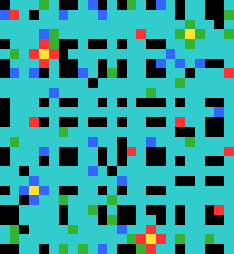
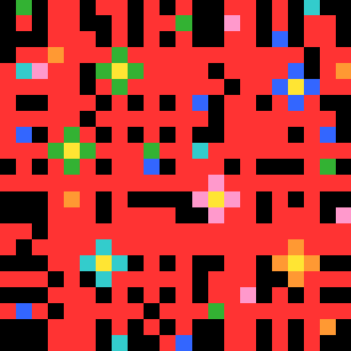
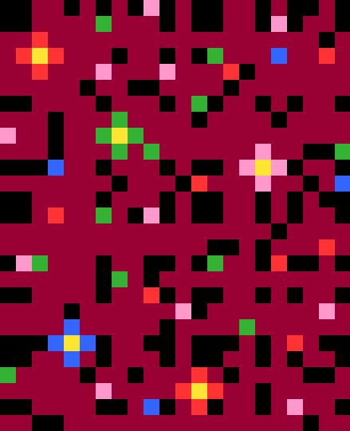

# ARC Task 642d658d: Universal Pattern Matching

## Task Overview

This ARC (Abstraction and Reasoning Corpus) task requires finding the output color for a given test input by learning patterns from training examples.

| Train 0 Input | Train 0 Output |
|---|---|
|  |  |

| Train 1 Input | Train 1 Output |
|---|---|
|  |  |

| Train 2 Input | Train 2 Output |
|---|---|
|  |  |

| Test 0 Input |
|---|
|  |

**The Goal:** Given the test input, predict the output color (a single color for the entire grid).

## Core Concepts

### 1. Universal Schemas (Patterns)

A **universal schema** is a pattern template that captures consistent structures across training examples. It uses three types of symbols:

- **Numbers (0-9)**: Must match exactly this color
- **Variables (X, Y, Z)**: Must be the same color within the pattern, but can be any color
- **Wildcards (*)**: Can be any color, no constraints

#### Example Schema (3×3):
```
[4 X *]
[X * *] 
[Y * Y]
```

This pattern means:
- Top-left must be color 4 (yellow)
- Position (0,1) and (1,0) must be the same color (call it X)
- Position (2,0) and (2,2) must be the same color (call it Y)
- All * positions can be any color

### 2. Pattern Matching Process

For each training example, we:
1. **Extract windows** of different shapes (1×3, 3×1, 3×3, 5×5) from the input grid
2. **For each position in the window template**, collect windows where that position contains color 4
3. **Create schemas** from these window collections by identifying constant vs. variable positions
4. **Intersect schemas** across all examples to find universal patterns

#### Window Collection Example:
For 3×3 windows and position (1,1) = center:
```
All 3×3 windows from grid:

Window 1:    Window 2:    Window 3:
[1 0 3]      [0 3 2]      [3 2 1]
[0 2 4]      [2 4 1]      [4 1 3]
[3 1 4]      [1 4 0]      [4 0 2]

Keep only windows where position (1,1) = 4:

Window 2:
[0 3 2]  ← center position (1,1) contains 4
[2 4 1]  
[1 4 0]  

For position (0,0) = top-left, keep only windows where (0,0) = 4:

Window 3:
[4 1 3]  ← top-left position (0,0) contains 4
[0 2 4]
[2 4 1]
```

### 3. Schema Intersection

For each window position where we collected windows with color 4, we find the **intersection** - the pattern that holds across ALL training examples.

#### Example Intersection:
For position (1,1) - windows where center = 4:
```
Training example 1:
[0 3 2]    
[2 4 1]  ← center is 4
[1 4 0]

Training example 2:
[1 0 5]    
[3 4 2]  ← center is 4  
[0 1 3]

Training example 3:
[2 1 0]
[5 4 0]  ← center is 4
[3 2 1]

Intersection schema:
[* * *]    (no consistent pattern except...)
[* 4 *]    (center is always 4 - as required)
[* * *]    (no other positions are constant)
```

The intersection keeps only the constraints that hold across ALL examples. Since we collected windows where position (1,1) = 4, that position will always be 4 in the final schema.

### 4. Universal Matching

The universal matcher `match_universal_pos(shape=(h,w))` works as follows:

1. **Input**: A grid and pre-computed universal schemas for shape (h,w)
2. **Process**: Slide the schemas across every possible position in the grid
3. **Output**: All positions where a schema matches, plus what color should go there

#### Matching Example:
```
Grid:           Schema:        Match at (0,0)?
[0 4 2]        [4 * *]        
[1 4 3]   vs   [* 4 *]   →   Check positions:
[2 0 1]        [* * 4]        (0,0): 0 vs 4 ✗

Grid:           Schema:        Match at (0,1)?  
[0 4 2]        [4 * *]
[1 4 3]   vs   [* 4 *]   →   Extract 3x3 starting at (0,1):
[2 0 1]        [* * 4]        [4 2 ?] - window goes outside grid ✗

Match requires the full schema to fit within grid bounds.
```

### 5. Aggregation: From Matches to Color

After finding all pattern matches, we need to decide on a single output color. Different **aggregators** use different strategies:

#### OpUniformColorFromMatches
- Collect all colors from matched positions
- Return the most common (mode) color

#### OpUniformColorFromMatchesExcludeGlobal  
- Same as above, but ignore the most common color in the entire grid
- Useful when the background color dominates

#### OpUniformColorFromMatchesUniformNeighborhood
- For each match, check if the neighborhood around the center has uniform color
- Only use matches where the neighborhood is uniform
- Return mode of those colors

### 6. Program Pipeline

A complete program is a pipeline: **Matcher → Aggregator**

Example: `match_universal_pos(shape=(3,3)) |> OpUniformColorFromMatchesUniformNeighborhood`

1. **Matcher** finds all 3×3 positions where universal schemas match
2. **Aggregator** filters to uniform neighborhoods and returns mode color

## Method: Universal Pattern Learning

### Training Phase
1. **Extract windows** around color 4 centers from all training inputs
2. **Build universal schemas** by intersecting patterns across examples  
3. **Test multiple shapes** (1×3, 3×1, 3×3, 5×5) to find the best patterns

### Prediction Phase  
1. **Apply universal matchers** to find all pattern occurrences in test input
2. **Use aggregators** to convert matches into a single predicted color
3. **Return programs** that work perfectly on training data

## Results

### Found Programs
The system discovers programs like:
- `match_universal_pos(shape=(1, 3)) |> OpUniformColorFromMatchesUniformNeighborhood [✓ 1/1 test]`
- `match_universal_pos(shape=(3, 3)) |> OpUniformColorFromMatchesExcludeGlobal(cross_only=True) [✓ 1/1 test]`

The `[✓ 1/1 test]` indicator shows this program correctly predicts the test case.

### Visual Results


This mosaic shows:
- **Left panels**: Input grids with yellow rectangles marking where patterns match
- **Right panels**: The predicted output color
- **Columns**: Different pattern shapes (1×3, 3×1, 3×3, 5×5)
- **Rows**: Training and test examples

## Technical Implementation

### Core Operations

**Grid → Matches**: `match_universal_pos(shape=(h,w))`
- Finds all positions where universal schemas of size h×w match
- Returns match locations and associated colors

**Matches → Color**: Various aggregators
- `OpUniformColorFromMatches`: Simple mode of matched colors
- `OpUniformColorFromMatchesExcludeGlobal`: Mode excluding background  
- `OpUniformColorFromMatchesUniformNeighborhood`: Mode of uniform neighborhoods
- `OpUniformColorPerSchemaThenMode`: Per-schema mode, then global mode

### Search Strategy

The system enumerates all possible **Matcher + Aggregator** combinations and keeps those that achieve perfect accuracy on training examples. Test performance is evaluated separately and clearly marked.

## Running the Code

### Requirements
- Python 3.10+ with `numpy`

### Usage
```bash
python3 repro.py
```

### Outputs
- **Visual**: `images/overlay_mosaic.png` - Pattern matches and predictions
- **Programs**: `programs_found.json` - All discovered programs with test results  
- **Stats**: `repro_stats.json` - Performance metrics and timing

### Customization
To try different pattern shapes:
```python
dsl.enumerate_programs_for_task(task, universal_shapes=[(1,3),(3,1),(3,3),(5,5)])
```

## Key Insights

1. **Universal patterns** work across all training examples, making them robust
2. **Multiple shapes** capture different types of spatial relationships
3. **Test indicators** (✓/✗) help distinguish reliable vs. overfitted programs
4. **Aggregation strategy** is crucial - different tasks need different approaches

The core insight is that ARC tasks often have consistent local patterns, and by finding the intersection of these patterns across examples, we can build reliable predictors for new inputs.