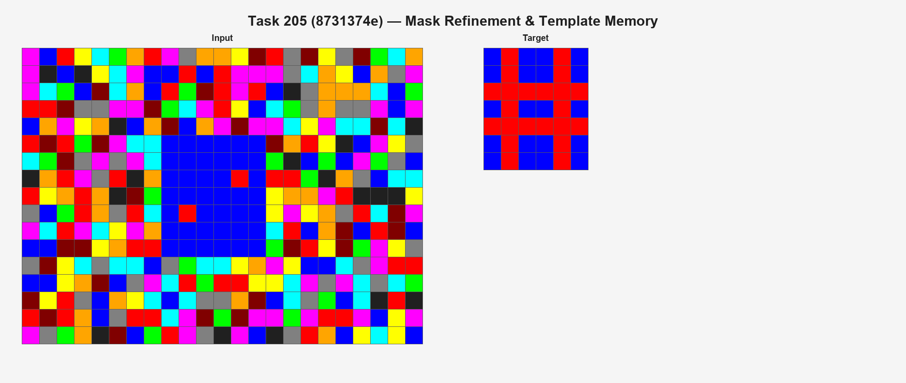

# Value–Program Abstraction Report

This companion note distils the abstraction-refinement experiment run on the curated ARC task set (see background threads [1967432164024189413](https://x.com/ccrisccris/status/1967432164024189413) and [1968543176173760936](https://x.com/ccrisccris/status/1968543176173760936)). The sweep generates per-task notes (`analysis/task*_abstractions_report.md`) capturing solver traces; this report pulls the common patterns together so the experiment is easy to follow inside `compositional-program-synthesis`.

Each solver is decomposed into **value abstractions** (what François Chollet calls *concepts*, signals distilled from the grid) and **program abstractions** (his *meta-programs*, procedures that transform those signals into outputs). The goal is to show how those refinement trails map onto the value→program pipeline that underpins Chollet’s arguments about compositional generalization through concept/meta-program pairings.

## Top Tasks Linked to Auto-Reports

- task 044 → [228f6490](https://arcprize.org/play?task=228f6490): fill top-two zero rooms with rare colour tie-breaks.
- task 071 → [3345333e](https://arcprize.org/play?task=3345333e): mirror topmost colour across a corrected axis.
- task 074 → [3631a71a](https://arcprize.org/play?task=3631a71a): enforce row-pair symmetry before diagonal maxing.
- task 096 → [4290ef0e](https://arcprize.org/play?task=4290ef0e): signature lookup blended with score-ordered heuristics.
- task 101 → [447fd412](https://arcprize.org/play?task=447fd412): relax anchor borders while preserving majority masks.
- task 134 → [5ad4f10b](https://arcprize.org/play?task=5ad4f10b): pick maximal density colour and accent with the sparsest.
- task 138 → [5daaa586](https://arcprize.org/play?task=5daaa586): extend guarded strokes per colour to close gap-1 lanes.
- task 153 → [681b3aeb](https://arcprize.org/play?task=681b3aeb): score displacement pairs to align big and small shapes.
- task 165 → [6d58a25d](https://arcprize.org/play?task=6d58a25d): extend filler-supported columns to close interior gaps.
- task 205 → [8731374e](https://arcprize.org/play?task=8731374e): tighten masks and memorise the unique four-hole layout.
- task 209 → [8a004b2b](https://arcprize.org/play?task=8a004b2b): rescale legends with count- and colour-aware offsets.
- task 240 → [9d9215db](https://arcprize.org/play?task=9d9215db): close coarse lattice edges while respecting symmetry hints.
- task 319 → [ce602527](https://arcprize.org/play?task=ce602527): rank crops by shape ratio with rare-tie fallbacks.
- task 355 → [de1cd16c](https://arcprize.org/play?task=de1cd16c): choose best cut via rare-colour quadrant purity.
- task 370 → [e8dc4411](https://arcprize.org/play?task=e8dc4411): adjust bbox jumps based on detected perimeter rings.
- task 394 → [f9012d9b](https://arcprize.org/play?task=f9012d9b): align periodic rows/columns and copy hidden segments.

## 1. Value→Program Pipeline (Chollet Alignment)

The pipeline begins by reading off value abstractions such as component inventories, spatial anchors, or coarse lattice statistics. These are then consumed by program abstractions—ranking heuristics, geometric transforms, blend logic—that deliver the final solver behaviour. The diagram highlights the directional flow: value signals feed transform recipes, which in turn produce a task-specific solver.

## 2. Value Abstractions (Concept Layer)

- **Component- and colour-centric signals**: Dominant components, rare colours, symmetry seeds, and coarse density masks recur across tasks — these are the concept atoms the refinement solver keeps rediscovering. ([044](https://arcprize.org/play?task=228f6490), [101](https://arcprize.org/play?task=447fd412), [134](https://arcprize.org/play?task=5ad4f10b), [138](https://arcprize.org/play?task=5daaa586), [165](https://arcprize.org/play?task=6d58a25d), [205](https://arcprize.org/play?task=8731374e), [355](https://arcprize.org/play?task=de1cd16c)).
- **Spatial anchors**: Bounding boxes, centroid quadrants, row/column pairings, and lattice positions align solver decisions — translating raw grids into the coordinate frames Chollet emphasises. ([074](https://arcprize.org/play?task=3631a71a), [153](https://arcprize.org/play?task=681b3aeb), [209](https://arcprize.org/play?task=8a004b2b), [370](https://arcprize.org/play?task=e8dc4411)).
- **Periodic or ratio fingerprints**: Signature lookups, mask ratios, and periodic row/column matches act as unique identifiers when simple counts are insufficient, bridging from empirical cues to concept tokens. ([096](https://arcprize.org/play?task=4290ef0e), [319](https://arcprize.org/play?task=ce602527), [394](https://arcprize.org/play?task=f9012d9b)).
- **Template exceptions**: Some tasks memorise specific grids or rare configurations once other signals flag them, illustrating the boundary where concept coverage is incomplete. ([096](https://arcprize.org/play?task=4290ef0e), [205](https://arcprize.org/play?task=8731374e)).

## 3. Program Abstractions (Meta-Program Layer)

- **Heuristic selection pipelines**: Ordered rule sets (nearest vs farthest placement, density prioritisation, mask strictness) iteratively refine a solution — the meta-program layers that the solver mutates. ([044](https://arcprize.org/play?task=228f6490), [134](https://arcprize.org/play?task=5ad4f10b), [165](https://arcprize.org/play?task=6d58a25d), [205](https://arcprize.org/play?task=8731374e)).
- **Geometric transforms**: Mirroring, rotation, scaling, displacement scoring, and row/column alignment supply the structural edits, matching Chollet’s call for reusable spatial programs. ([071](https://arcprize.org/play?task=3345333e), [074](https://arcprize.org/play?task=3631a71a), [153](https://arcprize.org/play?task=681b3aeb), [209](https://arcprize.org/play?task=8a004b2b), [370](https://arcprize.org/play?task=e8dc4411), [394](https://arcprize.org/play?task=f9012d9b)).
- **Voting and blending**: Weighted blends between heuristics and lookups, or between multiple colour votes, ensure coverage of edge cases without collapsing to brute force. ([096](https://arcprize.org/play?task=4290ef0e), [101](https://arcprize.org/play?task=447fd412), [355](https://arcprize.org/play?task=de1cd16c)).
- **Fallback choreography**: Solvers switch between abstractions based on signal availability (e.g., signature lookup → heuristic mirror) to guarantee completeness, echoing Chollet’s emphasis on adaptive meta-program selection. ([096](https://arcprize.org/play?task=4290ef0e), [205](https://arcprize.org/play?task=8731374e), [240](https://arcprize.org/play?task=9d9215db)).

## 4. Case Studies

### Task 074 ([3631a71a](https://arcprize.org/play?task=3631a71a)) – Row-Pair Symmetry

- **Value abstractions**: Opposing row pairs `(i, H+1-i)` and the exceptional treatment of colour `9` (brown).
- **Program abstractions**: Iteratively unify each row pair before reapplying a diagonal symmetry, ensuring sparse upper rows are filled.

### Task 101 ([447fd412](https://arcprize.org/play?task=447fd412)) – Anchor-Constrained Filling

- **Value abstractions**: Majority anchor masks, zero-border guards, and per-component coverage states.
- **Program abstractions**: A border-relaxing fill program that processes scales largest-first while preventing anchor overwrites.

### Task 205 ([8731374e](https://arcprize.org/play?task=8731374e)) – Mask Refinement and Template Memory

- **Value abstractions**: Component masks filtered by row/column coverage thresholds, detection of singleton noise, and recognition of the unique 6×8 four-hole grid.
- **Program abstractions**: Graduated mask filtering rules culminating in a bespoke reconstruction fallback.

## 6. Takeaways (Linking Back to Chollet)

- Every solver factors its behaviour through a value → program abstraction hand-off; separating these layers clarifies why each refinement was necessary and makes the “concept → meta-program → task” chain explicit.
- Visualising the pipeline makes it easier to spot reusable building blocks (e.g., lattice classification, displacement scoring) for new ARC tasks, mirroring Chollet’s call for modular concept inventories.
- Pairing index tables with case studies supports quick recall of both the signal vocabulary and the transformation repertoire, highlighting how each auto-generated run advances along Chollet’s abstraction ladder.
