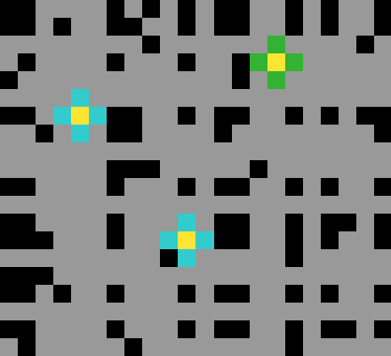

# ARC Task 642d658d

## Examples

| Train 0 Input | Train 0 Output |
|---|---|
|  |  |

| Train 1 Input | Train 1 Output |
|---|---|
|  |  |

| Train 2 Input | Train 2 Output |
|---|---|
|  |  |

## Test Input

| Test 0 Input |
|---|
|  |
